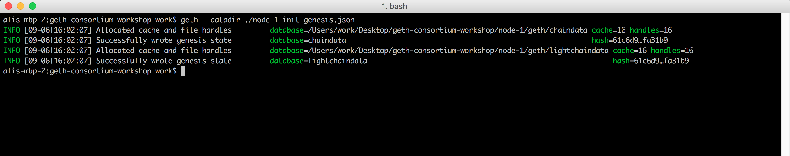
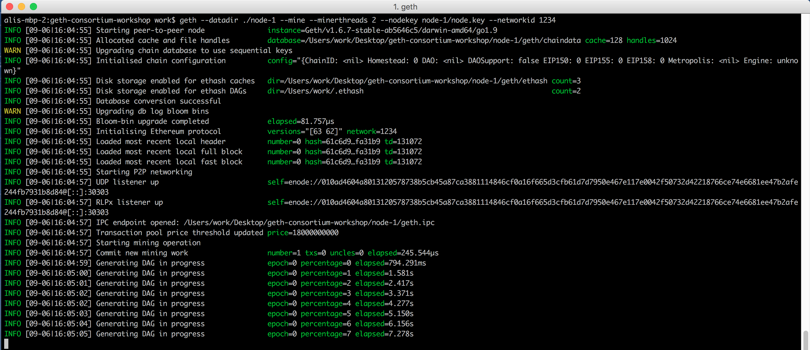
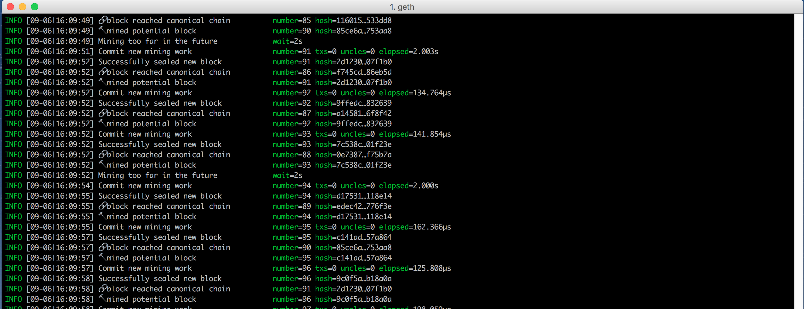
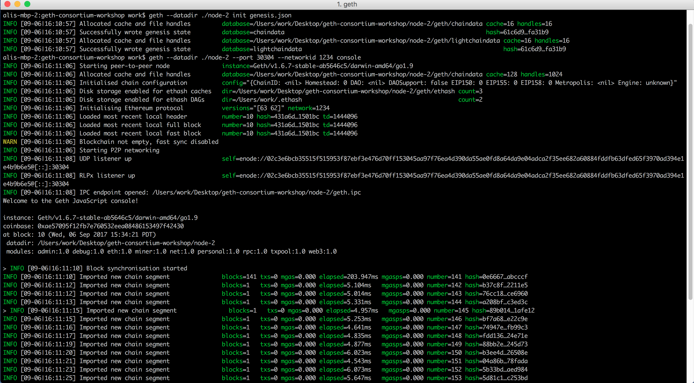
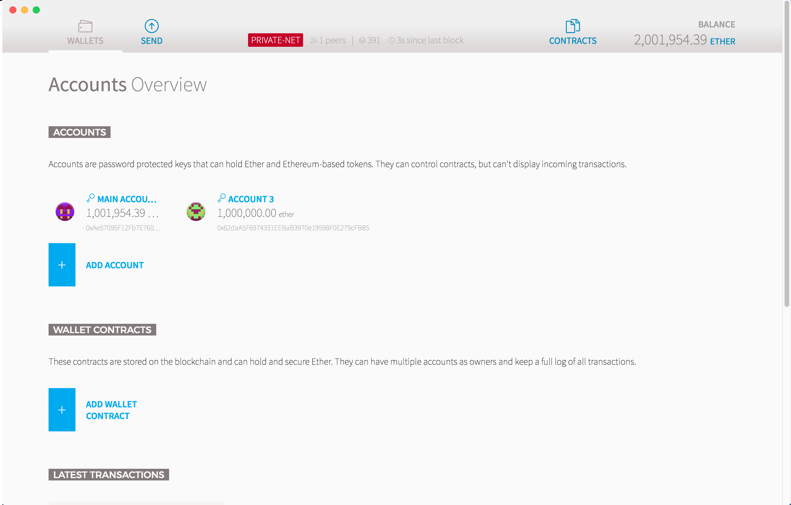

# Set up a local geth private consortium

This workshop walks you through setting up a private consortium of geth clients with three members. You can read the [official documentation](https://github.com/ethereum/go-ethereum/wiki/Private-network) on ethereum private networks.

> **Disclaimer: The content of this repo is for testing and demo purposes only. Make sure to change the provided `genesis.json`, accounts, `node.key`, and `static-nodes.json` for production in addition to security needs for running a blockchain consortium.**

## Dependencies

### Download Go-Ethereum (geth)

* You can get geth via [installers](https://ethereum.github.io/go-ethereum/downloads/) or via [package managers](https://ethereum.github.io/go-ethereum/install/)
* Make sure you have `geth` in your path. You can check that by running `which geth` command.

### Download the Ethereum or Mist wallet
* Download [Ethereum or Mist Wallet](https://github.com/ethereum/mist/releases) for your operating system

## Networkid

You need to choose a `netwrokid` for your consortium. `netwrokid` can be an arbituraty number and it has to be passed to all nodes on start `--networkid <your network id>`. You can read more about it [here](https://github.com/ethereum/go-ethereum/wiki/Private-network#choosing-a-network-id).

## Node 1: miner

To run a blockchain (ethereum) network, you need some nodes to mine (create) blocks. These nodes are called miner nodes. You can read more about mining [here](https://github.com/ethereum/wiki/wiki/Mining).

### Initialize the genesis block
Open a new terminal window and run the flowing command. 

> Note: You only need to initiate geth once per node, after that you can just run the "starting command".

```
cd geth-consortium-workshop
geth --datadir ./node-1 init genesis.json
```

By running that command, you have turned the content of `genesis.json` to the hash for the first block.



### Start geth with mining enabled

```
geth --datadir ./node-1 --mine --minerthreads 2 --nodekey node-1/node.key --networkid <your network id> 
```

Now you are running a geth node with mining enabled. At this point your geth client is generating the [DAG](https://github.com/ethereum/wiki/wiki/Mining#ethash-dag).



Once dag is generated, your miner will start making blocks. All the ether generated from the miner will be deposited in `0xae57095f12fb7e760532eea08486153497f42430` account. The ether on private networks don't have any monetary value.



## Node 2: transaction node in console mode
Open a **new** terminal window and run the following commands:

```
# Navigate to the cloned project
cd geth-consortium-workshop

# Initialize the genesis block
geth --datadir ./node-2 init genesis.json

# Run geth
geth --datadir ./node-2 --port 30304 --networkid <your network id> console
```
By running this command, your second node will connect to the miner and download all the created blocks.



Your second node uses the `node-2/static-nodes.json` file to find the address of the first node. `geth` 
has a built-in discovery method, but it takes some time for nodes to discover one another. So we give them a little hint to speed things up.

After you sync up with the other nodes, your client will download 1 block at a time as blocks are generated. You are running your second node in `console` mode. Here are the cool things you can do in [geth console](https://github.com/ethereum/go-ethereum/wiki/JavaScript-Console).

## Node 3: transaction node with rpc enabled
Open a **new** terminal window and run the following commands:

```
# Navigate to the cloned project
cd geth-consortium-workshop

# Initialize the genesis block
geth --datadir ./node-3 init genesis.json

# Windows
geth --datadir ./node-3 --port 30305 --networkid <your network id>

# Mac
geth --datadir ./node-3 --port 30305 --ipcpath ${HOME}/Library/Ethereum/geth.ipc --networkid <your network id> 
```

## Attaching the Ethereum or Mist wallet
Now you can open the Ethereum or mist wallet. 




The wallet by default will look for an `IPC` socket opened by geth in order to communicate. If there is no `IPC` socket in the expected path (`\\.\pipe\geth.ipc` on Windows and `${HOME}/Library/Ethereum/geth.ipc` on mac) the wallet will run its own `geth` process to connect to the main network or the test network.

### Transferring Ether
> Coming soon

### Deploying contracts
> Coming soon

## Attaching to RPC using web3.js
> Coming soon


## Provided Accounts:

* Main account
    * Address: `0xae57095f12fb7e760532eea08486153497f42430`
    * Password: no password (just press enter)

* Account 1
    * Address: `0x62daa5f6974331eebab3970e19598f0e279cfb85`
    * Password: `2017`

